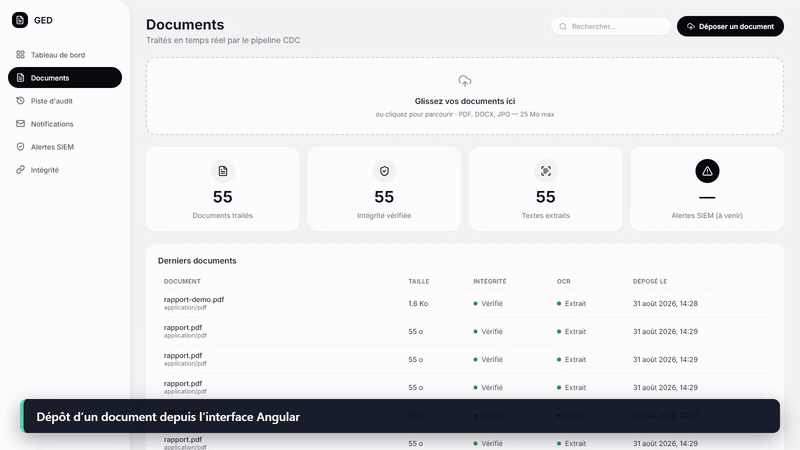
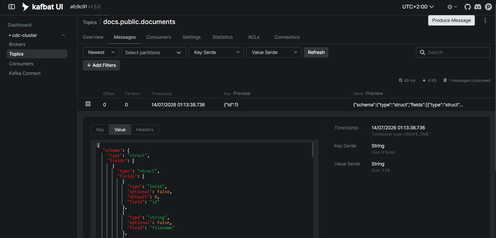
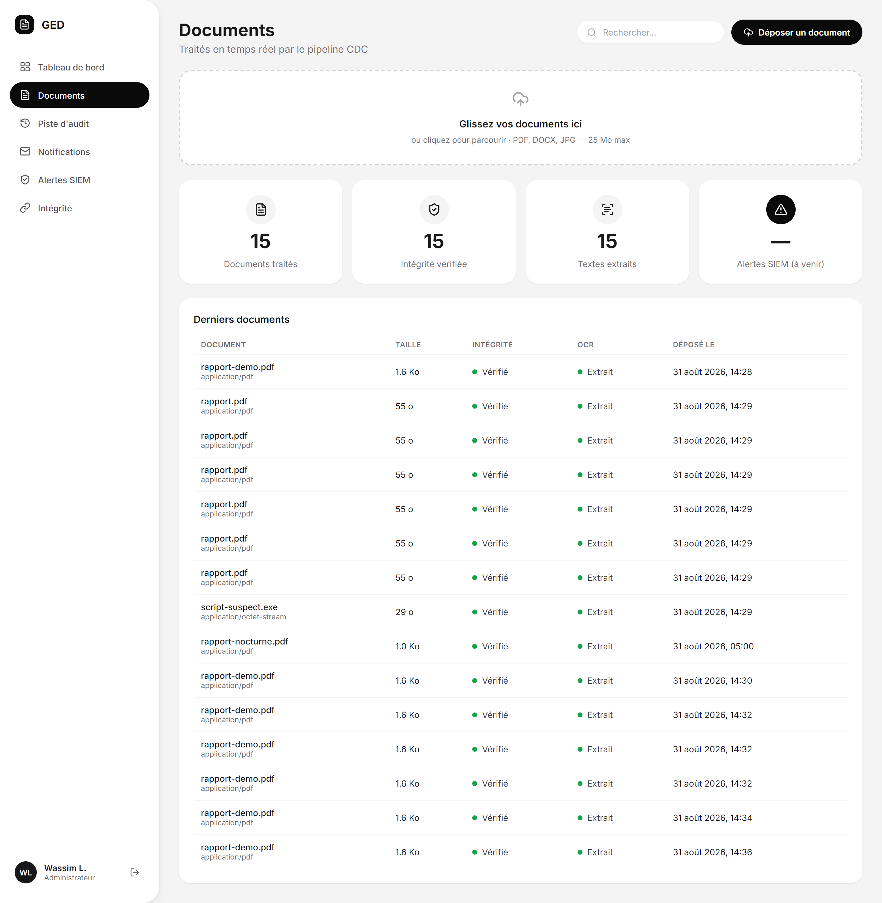

# cdc-streaming-pipeline

[](https://github.com/Wvssim/cdc-streaming-pipeline/actions/workflows/ci.yml)

## 🎬 Démonstration vidéo de la plateforme

> **Extrait animé de 16 secondes — lecture automatique et en boucle.**



Cette démonstration présente successivement l'interface documentaire, le suivi des traitements,
la supervision Kafka et le stockage objet.

Plateforme de dépôt et de traitement de documents, bâtie sur un **pipeline CDC event-driven** :
PostgreSQL → Debezium → Kafka → 5 microservices consommateurs indépendants (fan-out).

Projet réalisé dans le cadre d'un stage de fin d'année (filière DSI, 4ᵉ année) à EMSI Casablanca,
au sein de la société 6Solutions.

## Le principe

Quand un utilisateur dépose un document, ce simple dépôt déclenche automatiquement plusieurs
traitements en parallèle (audit, notification, intégrité, extraction de texte, sécurité), sans
qu'aucun service n'appelle un autre directement. Le mécanisme repose sur le **Change Data
Capture (CDC)** : au lieu que l'application prévienne chaque service, on lit le journal de
transactions de PostgreSQL — dès qu'une ligne est insérée, un événement est publié automatiquement.

```
Angular SPA ──upload──▶ documents-api ──métadonnées──▶ PostgreSQL ──WAL──▶ Debezium ──▶ Kafka
                             │                                                            │
                             └──fichier──▶ MinIO                          fan-out vers 5 consommateurs
                                            ▲                          (audit, notification, blockchain,
                                            └──lit le fichier──┘                 ocr, siem)
```

- **Claim Check** — le fichier binaire ne transite jamais par Kafka ni par la base ; il va dans
  MinIO, seule sa référence circule dans le pipeline.
- **Fan-out par consumer groups** — chaque service reçoit sa propre copie de chaque événement,
  indépendamment des autres.
- **Découplage total** — les consommateurs ne connaissent que le topic Kafka, jamais l'API ni
  les autres services.

**Diagrammes détaillés** (architecture, séquences, modèle de données) :
**[docs/diagrammes.md](docs/diagrammes.md)**.
Documentation technique de référence : **[docs/ARCHITECTURE.md](docs/ARCHITECTURE.md)** (source de
vérité) et **[docs/cahier-des-charges.tex](docs/cahier-des-charges.tex)**.
Plan de travail : **[docs/plan-6-semaines.md](docs/plan-6-semaines.md)**.

## Architecture

**6 microservices Spring Boot**, monorepo Maven multi-module (Java 21, Spring Boot 4) :

| Service | Rôle | Port | Endpoint de lecture |
|---|---|---|---|
| `documents-api` | Producteur. Upload multipart → métadonnées PostgreSQL + fichier MinIO. Émet aussi le JWT (`POST /api/auth/login`). Expose téléchargement, renommage et suppression | 8081 | `GET /api/documents` |
| `audit-service` | Trace de chaque opération (qui, quoi, quand) | 8082 | `GET /api/audit` |
| `notification-service` | E-mail de confirmation à l'utilisateur (MailHog en dev) | 8084 | `GET /api/notifications` |
| `blockchain-service` | Registre d'intégrité par chaîne de hash SHA-256 | 8085 | `GET /api/integrity` |
| `siem-service` | Détection de comportements anormaux (3 règles) | 8086 | `GET /api/alerts` |
| `ocr-service` | Extraction de texte (Apache Tika ; Tesseract en option pour les images) | 8087 | `GET /api/ocr/{docId}` |

Module partagé `common` : DTO de l'enveloppe Debezium (`before`/`after`/`op`/`ts_ms`) + `JwtService`.

Infrastructure (Docker Compose) : PostgreSQL 17 (`wal_level=logical`), Kafka 4.1 en mode KRaft,
Debezium 3.5 (connecteur, pas de code), MinIO, MailHog, Kafbat UI.




## Démarrage

Prérequis : **Docker** (+ Compose), **JDK 21** (stack figée), **Node 20.19+ / 22.12+** (frontend
Angular 21), `curl` et `jq`. Sous Windows, exécuter les scripts `.ps1` dans PowerShell.

### 1. Infrastructure

```bash
cd infra
docker compose up -d     # Postgres, Kafka (KRaft), Connect+Debezium, MinIO, MailHog, Kafbat UI
docker compose ps        # 6 containers "running" (+ createbuckets en Exited 0, one-shot)
```

> Pour repartir de zéro : `docker compose down -v` (sinon `init-scripts/` ne se rejoue pas et
> l'ancien slot de réplication persiste).

### 2. Connecteur Debezium

À faire **une fois** que Connect est démarré (~40 s après le `up`), **avant** tout upload —
sans lui, aucun événement n'est produit.

```bash
# Windows :
./register-connector.ps1
# Linux / macOS :
curl -X POST -H "Content-Type: application/json" \
  --data @connectors/postgres-source.json http://localhost:8083/connectors

# Vérifier : le connecteur ET sa task doivent être "RUNNING"
curl http://localhost:8083/connectors/source-postgres-connector/status
```

### 3. Build

```bash
cd ..
mvn -B verify            # nécessite un JDK 21
```

### 4. Lancer les 6 services

```bash
# Windows :
./infra/run-services.ps1          # (arrêt : ./infra/run-services.ps1 -Stop)
# Linux / macOS :
./infra/run-services.sh           # (arrêt : ./infra/run-services.sh stop)
```

<details>
<summary>Équivalent manuel</summary>

```bash
for s in documents-api audit-service notification-service blockchain-service siem-service ocr-service; do
  java -jar $s/target/$s-0.0.1-SNAPSHOT.jar &
done
```
</details>

### 5. Frontend (démo pilotée par le navigateur)

```bash
cd frontend
npm install
npm start                # http://localhost:4200
```

Se connecter avec les identifiants de démo **`wassim` / `wassim2026`**, puis déposer un document
depuis l'écran *Documents* et parcourir les 7 écrans.

### 5 bis. Démo sans navigateur (curl)

```bash
# Authentification (seul POST /api/auth/login est public)
TOKEN=$(curl -s -X POST http://localhost:8081/api/auth/login \
  -H "Content-Type: application/json" -d '{"username":"wassim","password":"wassim2026"}' | jq -r .token)

# Déposer un document
curl -H "Authorization: Bearer $TOKEN" -F "file=@monfichier.pdf" -F "uploadedBy=demo" \
  http://localhost:8081/api/documents

# Télécharger le contenu original (remplacer 1 par l'identifiant retourné)
curl -OJ -H "Authorization: Bearer $TOKEN" \
  http://localhost:8081/api/documents/1/content

# Vérifier le fan-out : le même événement a déclenché les 4 services
curl -H "Authorization: Bearer $TOKEN" http://localhost:8082/api/audit
curl -H "Authorization: Bearer $TOKEN" http://localhost:8084/api/notifications
curl -H "Authorization: Bearer $TOKEN" http://localhost:8085/api/integrity
curl -H "Authorization: Bearer $TOKEN" http://localhost:8086/api/alerts
```

### 6. Générateur de données de démo (optionnel)

`infra/demo-seed.sh` dépose des documents qui déclenchent les 3 règles SIEM de façon
reproductible (fréquence anormale, horaire inhabituel, extension suspecte). `documents-api` doit
tourner.

## Interfaces (dev)

| Service | URL | Identifiants |
|---|---|---|
| Frontend Angular | http://localhost:4200 | `wassim` / `wassim2026` |
| Kafbat UI (topics Kafka) | http://localhost:8080 | — |
| Kafka Connect (REST) | http://localhost:8083 | — |
| MinIO Console | http://localhost:9001 | `minioadmin` / `minioadmin` |
| MailHog | http://localhost:8025 | — |

## Sécurité (JWT)

Les endpoints `/api/**` des 6 services exigent un JWT valide (`Authorization: Bearer <token>`),
sauf `POST /api/auth/login`, émis par `documents-api`.

- **Identifiants de démo** (utilisateur unique en dur, pas de table `users` — hors périmètre) :
  `wassim` / `wassim2026`.
- Chaque service valide le token lui-même avec le même secret partagé : **pas de gateway
  centrale** (cf. « Périmètre exclu » dans `docs/ARCHITECTURE.md`). Les valeurs par défaut codées
  dans chaque `application.yml` suffisent pour la démo — rien à configurer.
- Variables d'environnement (à garder identiques sur les 6 services pour `JWT_SECRET`) :
  - `JWT_SECRET` — secret HMAC partagé (valeur de démo par défaut, à changer en prod).
  - `JWT_TTL_MINUTES` — durée de validité du token (défaut `480`, soit 8 h).
  - `AUTH_USERNAME` / `AUTH_PASSWORD_HASH` (uniquement sur `documents-api`) — identifiant et hash
    bcrypt du mot de passe.
- Le frontend Angular gère la connexion (écran `/login`), stocke le token et l'attache
  automatiquement aux appels vers les 6 APIs (interceptor HTTP) ; un guard de route redirige vers
  `/login` si non connecté.

## Documentation des API (OpenAPI / Swagger)

Chaque service expose sa documentation générée par **springdoc-openapi 3.1.0** (branche 3.x =
celle qui suit Spring Boot 4), en accès libre (pas de JWT requis sur ces deux routes) :

| Route | Contenu |
|---|---|
| `http://localhost:<port>/swagger-ui.html` | explorateur Swagger UI |
| `http://localhost:<port>/v3/api-docs` | contrat OpenAPI 3 (JSON) |

Ex. `documents-api` : http://localhost:8081/swagger-ui.html

## OCR des images (Tesseract)

`ocr-service` route automatiquement les images (`content_type` commençant par `image/`) vers
Tesseract, les autres formats (PDF/DOCX) restant sur Tika. Tesseract (via `tess4j`) s'appuie sur
le moteur natif du même nom. La CI installe le moteur et exécute un vrai test OCR sur une image
générée pendant le test ; elle ne se limite donc pas à simuler l'extracteur.

Pour l'activer :
1. Installer Tesseract OCR ([UB Mannheim builds](https://github.com/UB-Mannheim/tesseract/wiki)
   sous Windows, `apt install tesseract-ocr tesseract-ocr-fra` sous Linux).
2. Repérer le dossier `tessdata` (contient `fra.traineddata`, `eng.traineddata`).
3. Définir `TESSERACT_DATAPATH` (chemin vers ce dossier) avant de lancer `ocr-service` ;
   `TESSERACT_LANGUAGES` (défaut `fra+eng`) au besoin.

## Avancement

- Infrastructure et socle CDC (Docker Compose, connecteur Debezium, CI)
- `documents-api` — upload, téléchargement, Claim Check MinIO, renommage et suppression
- `audit-service` — premier consommateur, jalon prouvé (upload → ligne d'audit automatique)
- `notification-service`, `blockchain-service`, `siem-service` — fan-out complet + Dead Letter
  Topic (1 upload → 4 services en parallèle, message invalide isolé en DLT)
- `ocr-service` — extraction via Apache Tika (PDF/DOCX) et Tesseract/tess4j pour les images,
  avec validation native dans la CI
- Frontend Angular — design system + 7 écrans (Tableau de bord, Documents, Piste d'audit,
  Notifications, Alertes SIEM, Intégrité, Détail document) branchés sur les vraies APIs
- Tests d'intégration Testcontainers e2e, générateur de données de démo (S6 · T6.1 / T6.2)
- Sécurité JWT sur les 6 services + frontend Angular (S6 · T6.3)
- README / diagrammes / doc technique + OpenAPI/Swagger par service (S6 · T6.4)
- Rapport finalisé (S6 · T6.5)
- Répétition du scénario de démo, base propre, chronométrée (S6 · T6.6)

## Build & tests

```bash
mvn -B verify            # compilation + tests unitaires + tests Testcontainers e2e (JDK 21)
```

Les tests e2e démarrent des conteneurs Postgres + Kafka + Connect éphémères (Testcontainers) :
prévoir de la marge au premier run (pull des images). CI : `mvn -B -ntp verify` à chaque push
([`.github/workflows/ci.yml`](.github/workflows/ci.yml)).

### Validation du rejeu et de la charge

Le service ciblé doit être arrêté avant la remise à zéro de ses offsets :

```powershell
.\infra\replay-consumer.ps1 -Group audit-service
.\infra\load-test.ps1 -Deposits 30
```

Le test de charge vérifie à la fois le débit cible de 30 dépôts/minute et le retour à un lag
agrégé nul pour les cinq consumer groups.
