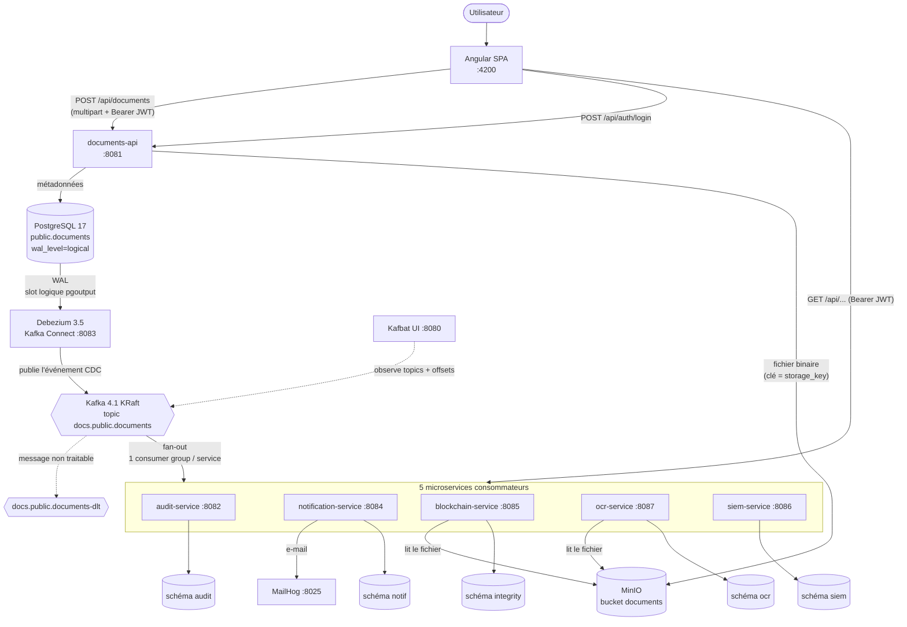
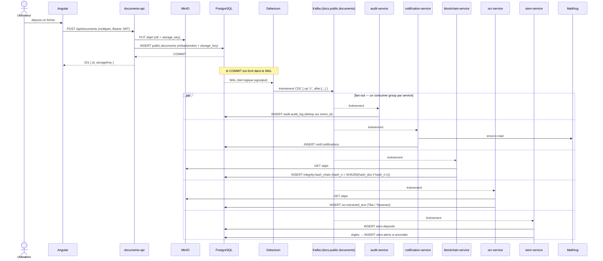
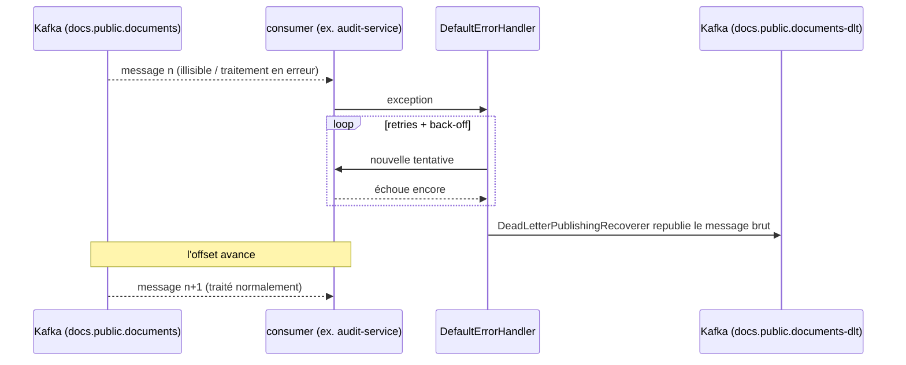
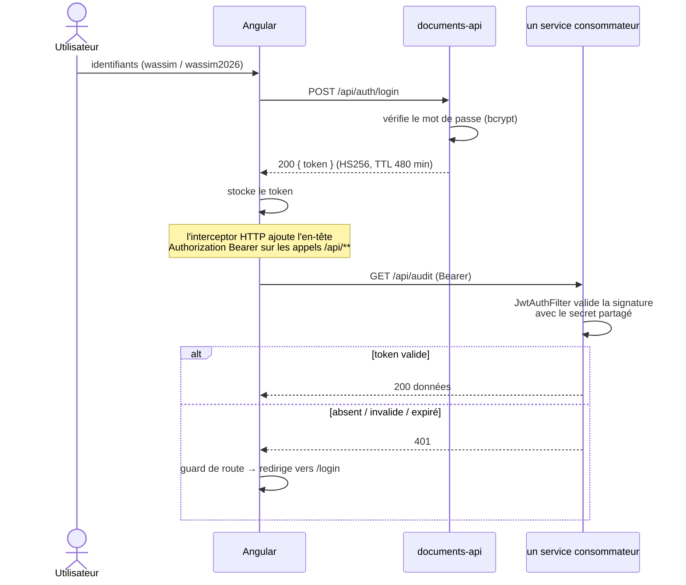
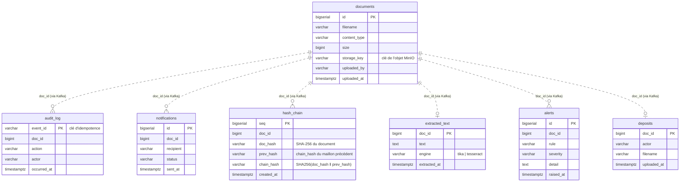

# Diagrammes — cdc-streaming-pipeline

Diagrammes de référence du projet. La source de vérité reste [`ARCHITECTURE.md`](ARCHITECTURE.md) ;
ce fichier ne fait que la mettre en images. Les blocs ` ```mermaid ` sont rendus directement par
GitHub (aucun outil à installer).

Sommaire :

1. [Architecture / flux des composants](#1-architecture--flux-des-composants)
2. [Séquence — dépôt d'un document et fan-out](#2-séquence--dépôt-dun-document-et-fan-out)
3. [Séquence — message toxique et Dead Letter Topic](#3-séquence--message-toxique-et-dead-letter-topic)
4. [Séquence — authentification JWT](#4-séquence--authentification-jwt)
5. [Modèle de données — un schéma par service](#5-modèle-de-données--un-schéma-par-service)

---

## 1. Architecture / flux des composants

Le fichier binaire ne transite jamais par Kafka ni par PostgreSQL (**Claim Check**). L'événement
naît du WAL de PostgreSQL via Debezium (**CDC**), jamais d'un `write` applicatif vers Kafka
(pas de *dual-write*). Chaque service consomme le topic avec **son propre consumer group** (fan-out).



> Debezium ne surveille **que** `public.documents` (`table.include.list`) : les schémas des
> consommateurs ne sont jamais captés, sinon boucle infinie.

---

## 2. Séquence — dépôt d'un document et fan-out

Chemin nominal : un `POST` HTTP finit par déclencher 5 traitements, **sans aucun appel direct**
entre services.



> Consommation **at-least-once** : un même événement peut être livré deux fois. Chaque service
> est idempotent (déduplication par `doc_id` / `event_id`).

---

## 3. Séquence — message toxique et Dead Letter Topic

Un message que le consommateur n'arrive pas à traiter ne doit **jamais** bloquer le pipeline
(invariant 7).



---

## 4. Séquence — authentification JWT

`documents-api` est le **seul** émetteur de token. Les 6 services valident le JWT eux-mêmes avec
le même secret partagé (`JWT_SECRET`) : pas de gateway centrale (invariant 10, cohérent avec
l'exclusion de Spring Cloud Gateway).



---

## 5. Modèle de données — un schéma par service

Une seule instance PostgreSQL, un schéma par service (isolation logique, pas de
*database-per-service*). Les liens `doc_id` sont **logiques** : ils transitent par Kafka, il n'y a
aucune clé étrangère inter-schémas.



| Schéma | Propriétaire | Table(s) |
|---|---|---|
| `public` | `documents-api` | `documents` — **seule table captée par Debezium** |
| `audit` | `audit-service` | `audit_log` |
| `notif` | `notification-service` | `notifications` |
| `integrity` | `blockchain-service` | `hash_chain` (append-only) |
| `ocr` | `ocr-service` | `extracted_text` |
| `siem` | `siem-service` | `alerts`, `deposits` (historique interne alimenté par Kafka) |
