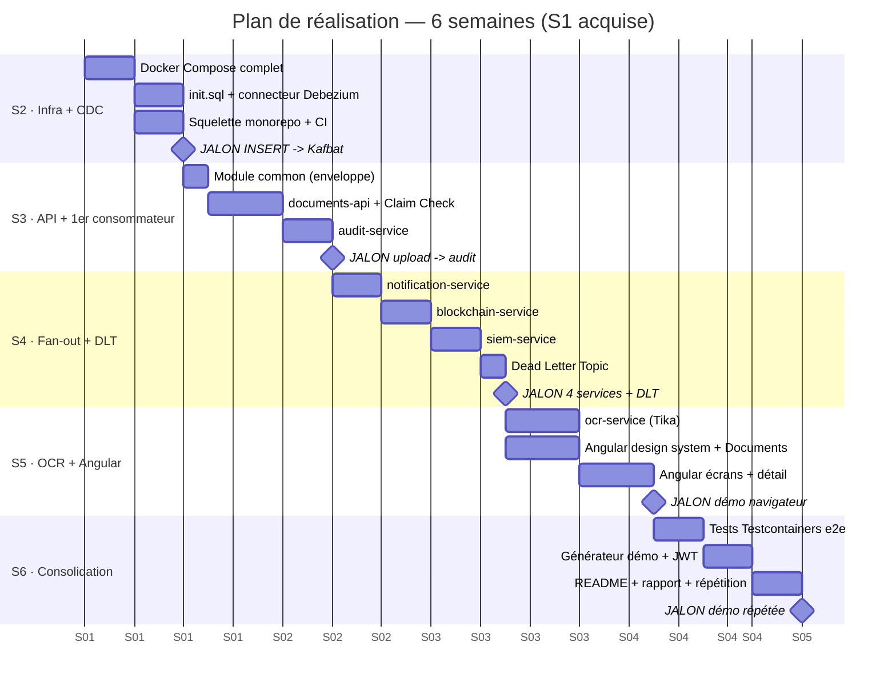

# Plan de réalisation — 6 semaines

**Projet** : Plateforme Documentaire Événementielle (pipeline CDC event-driven)
**Étudiant** : Wassim Lazim — EMSI Casablanca (développe seul)
**Encadrant** : Pr. Bekkali Mohamed (spécialité JEE)
**Dépôt** : `cdc-streaming-pipeline`
**Période** : du `[date début S2 — à remplir]` au `[date soutenance — à remplir]`

> Ce plan est aligné sur `CLAUDE.md` (source de vérité). Noms figés : base `docdb` / user `cdc` /
> conteneur `cdc-postgres` ; connecteur `source-postgres-connector` (config `infra/register-postgres.json`) ;
> topic `docs.public.documents` ; infra dans `infra/`. En cas d'écart, `CLAUDE.md` prime.
>
> Méthode : LLM comme architecte/reviewer, agent de code (Claude Code) comme exécutant. Chaque tâche est
> formulée pour être déléguée telle quelle. 1 semaine ≈ 5 jours = **10 demi-journées**. Les estimations
> laissent volontairement du tampon (étudiant seul qui découvre Kafka et Debezium).

---

## 1. Rappel du contexte et de l'acquis (semaine 1 — terminée ✅)

L'objectif est une **plateforme de dépôt et de traitement de documents** reposant sur le CDC
(Change Data Capture). Le flux nominal, imposé par l'encadrant : l'utilisateur dépose un document
via Angular → `documents-api` enregistre les **métadonnées dans PostgreSQL** (`public.documents`) et le
**fichier dans MinIO** (pattern *Claim Check* : le binaire ne transite jamais par Kafka ni par la base) →
**Debezium** lit le journal de transactions (WAL) et publie un **événement Kafka** (`docs.public.documents`)
→ **5 services consomment en parallèle** (fan-out, un consumer group chacun) : `audit-service`,
`notification-service`, `blockchain-service` (registre d'intégrité par chaîne de hash), `ocr-service`
(extraction de texte), `siem-service` (détection d'anomalies).

**Acquis de la semaine 1 (ne pas replanifier) :**
- Cadrage du sujet et validation du périmètre avec l'encadrant.
- Cahier des charges rédigé (besoins fonctionnels/non fonctionnels, architecture, choix
  technologiques justifiés, modèle de données, analyse des risques).
- Maquette Figma de l'écran *Documents* réalisée et validée — direction artistique : monochrome
  (noir/blanc/gris), aucune bordure (profondeur par ombres douces + fond gris), rayons généreux
  (cartes 20px, shell 28px), badges d'icônes ronds, boutons/pilules en radius 100, police **Inter**.
  La couleur n'apparaît que dans les pastilles de statut (vert = vérifié, ambre = en cours,
  rouge = alerte, gris = en attente).
- Stack technique arrêtée et versions figées (voir tableau ci-dessous).
- Dépôt Git créé.

**Correspondance avec l'architecture Azure de référence** (à rappeler en soutenance) :
Event Hubs → Kafka ; Synapse pipelines → Debezium/Kafka Connect ; Data Lake + SQL pools →
PostgreSQL + MinIO ; Azure ML → `ocr-service` ; AKS → microservices dockerisés ; Power BI →
dashboard Angular ; Power Apps → `notification-service` ; Entra ID → Spring Security + JWT ;
Azure Monitor → Actuator + Kafbat UI ; Defender for Cloud → `siem-service` ; Azure DevOps →
GitHub Actions.

**Stack figée** : Java 21 · Maven 3.9 multi-module · Spring Boot 4.x · Angular (stable) ·
Debezium 3.5 (`pgoutput`) · Kafka 4.1 KRaft · PostgreSQL 17 · MinIO · MailHog · Kafbat UI ·
Apache Tika + tess4j · Testcontainers · Docker Compose · GitHub Actions.

---

## 2. Vue d'ensemble

| Sem. | Objectif (une phrase) | Livrables clés | Jalon vérifiable |
|---|---|---|---|
| **S2** | Monter l'infra et **prouver la chaîne CDC** avant tout code métier | `infra/docker-compose.yml`, `infra/init.sql` (schémas + table `documents`), connecteur Debezium, squelette monorepo (parent + `common`), CI | **Un `INSERT` manuel → événement visible dans Kafbat UI** |
| **S3** | Valider le pattern event-driven **de bout en bout** | `documents-api` (upload + Claim Check + Swagger), module `common`, `audit-service` | **Un upload API crée une ligne d'audit, sans appel direct entre services** |
| **S4** | Répéter le pattern : **fan-out complet** + robustesse | `notification-service`, `blockchain-service`, `siem-service`, Dead Letter Topic | **1 upload → 4 services en parallèle ; message invalide → DLT sans blocage** |
| **S5** | **OCR + frontend Angular** (indépendants : si l'OCR bloque, on avance sur le front) | `ocr-service` (Tika), app Angular conforme maquette (6 écrans) | **Démo complète pilotée depuis le navigateur** |
| **S6** | Consolider, tester, préparer la soutenance (**tampon**) | Tests Testcontainers e2e, générateur de démo, sécurité JWT (si temps), README/diagrammes/rapport | **Scénario de démo répété avec succès + documentation finalisée** |

---

## 3. Diagramme de Gantt (Mermaid)



> Les dates ci-dessus sont des **ancres relatives** pour le rendu Mermaid ; remplacer par les vraies
> dates une fois `[date début S2]` connue. Seul l'ordre et la durée relative comptent.

---

## 4. Détail semaine par semaine

Légende estimations : `½j` = une demi-journée. **DoD** = *Definition of Done* (comment je sais que c'est fini).

### Semaine 2 — Infrastructure et socle CDC *(zéro code métier)*

> **Objectif :** monter toute l'infra et **prouver que la chaîne CDC fonctionne** (INSERT → événement Kafka)
> avant d'écrire la moindre ligne de code métier.
>
> ⚠️ **C'est la semaine la plus risquée** (Debezium + WAL + KRaft + réseau Docker) — d'où sa place en
> premier, avec un **jalon binaire** : soit l'événement apparaît dans Kafbat UI, soit non. Tant que ce
> jalon n'est pas vert, on ne passe pas à la S3.

| # | Tâche | Est. | Dépend de | Definition of Done |
|---|---|---|---|---|
| **T2.1** | Restructurer le repo en **monorepo Maven multi-module** : `pom.xml` parent à la racine (packaging `pom`, `<properties>` versions Java/Spring/Debezium, `<dependencyManagement>`, `<modules>`) + module `common` (vide pour l'instant). Supprimer l'ancien `analytics-consumer` du build (legacy RetailPulse). | 2 ½j | — | `mvn -q validate` passe à la racine ; `common` est listé dans les `<modules>` ; plus aucune référence à `analytics-consumer`/`ventes`/`retaildb`. |
| **T2.2** | Écrire `infra/docker-compose.yml` avec **6 services d'infra** : PostgreSQL 17 (conteneur `cdc-postgres`, user `cdc`, base `docdb`, `wal_level=logical`, `max_wal_senders`, `max_replication_slots`), Kafka 4.1 KRaft, Kafka Connect + Debezium 3.5, MinIO, MailHog, Kafbat UI (exposée sur `:8080`). Healthchecks sur chaque service. | 2 ½j | — | `cd infra && docker compose up -d` puis `docker compose ps` affiche les 6 services `running`/`healthy`. |
| **T2.3** | `infra/init.sql` : créer les **schémas** `public`, `audit`, `notif`, `integrity`, `ocr`, `siem` + la table `public.documents` (`id, filename, content_type, size, storage_key, uploaded_by, uploaded_at`) + `ALTER TABLE public.documents REPLICA IDENTITY FULL;`. Monté via `docker-entrypoint-initdb.d`. | 1 ½j | T2.2 | `docker exec -it cdc-postgres psql -U cdc -d docdb -c "\d documents"` montre la table + `Replica Identity: FULL` ; les 6 schémas existent. |
| **T2.4** | Service `createbuckets` (image `minio/mc`) qui crée le bucket `documents` au démarrage. | ½j | T2.2 | Le bucket `documents` est visible dans la console MinIO (`localhost:9001`). |
| **T2.5** | Rédiger `infra/register-postgres.json` (connecteur `source-postgres-connector` : `topic.prefix=docs`, `plugin.name=pgoutput`, `table.include.list=public.documents`, `slot.name`, converters JSON) + l'enregistrer via l'API REST de Kafka Connect (`POST /connectors`). | 1 ½j | T2.2, T2.3 | `curl http://localhost:8083/connectors/source-postgres-connector/status` renvoie `"state":"RUNNING"` pour le connecteur **et** sa task. |
| **T2.6** | 🏁 **JALON** : `INSERT` manuel dans `public.documents` via `psql`, puis ouvrir Kafbat UI (`localhost:8080`) → topic `docs.public.documents`. | 1 ½j | T2.5 | Le message CDC (`op:"c"`, `after` renseigné) est visible dans Kafbat UI. **Screenshot pris.** |
| **T2.7** | CI **GitHub Actions** : workflow `mvn -q verify` sur `push`/`pull_request` + badge de build dans le README. | 1 ½j | T2.1 | Le workflow est vert sur le dernier push ; le badge s'affiche dans le README. |

**Livrables S2 :** infra Docker complète et reproductible (`infra/`), schémas + table `documents` sous CDC,
connecteur Debezium enregistré, squelette monorepo (parent + `common`), pipeline CI vert, screenshot du
premier événement.

**Jalon vérifiable S2 :** *un `INSERT` manuel produit un événement visible dans Kafbat UI.*
**La chaîne CDC est prouvée avant toute ligne de code métier.**

**Points de vigilance :**
- `wal_level=logical` n'est pris en compte qu'au **démarrage propre** du conteneur : si tu changes la
  config après coup, fais `docker compose down -v` (sinon l'ancien volume garde `wal_level=replica`).
- Ordre de démarrage : le connecteur ne s'enregistre que **quand Connect est `healthy`** — attendre
  (`depends_on: condition: service_healthy` ou attente dans le script d'enregistrement).
- Bien utiliser le plugin **`pgoutput`** (natif Postgres), pas `decoderbufs` (nécessite une extension).
- Le **slot de réplication** reste actif tant que le connecteur existe : pour repartir de zéro, supprimer
  le connecteur *puis* `docker compose down -v`.
- Sous Windows / Docker Desktop : chemins de volumes en `/`, et penser au partage de fichiers si besoin.
- Le topic réel s'appelle `docs.public.documents` (`<topic.prefix>.<schema>.<table>`), pas `documents`
  tout court — le brief parle du « topic documents » de façon informelle.

### Semaine 3 — Producteur et premier consommateur *(valider le pattern de bout en bout)*

> **Objectif :** prouver que le pattern event-driven marche de bout en bout — un upload HTTP finit par
> créer une ligne d'audit **sans aucun appel direct** entre `documents-api` et `audit-service`.

| # | Tâche | Est. | Dépend de | Definition of Done |
|---|---|---|---|---|
| **T3.1** | Module **`common`** : DTO de l'enveloppe Debezium (`DebeziumEnvelope<T>` avec `before`, `after`, `op`, `ts_ms`) + `DocumentPayload` (mappe les colonnes de `public.documents`) + désérialisation Jackson. Tests unitaires de parsing sur un JSON réel capturé en S2. | 1 ½j | Jalon S2 | `mvn -pl common test` vert ; un JSON d'événement réel se parse en objet Java. |
| **T3.2** | **`documents-api`** : entité JPA `Document`, `DocumentRepository`, `DocumentService`, `DocumentController` (`POST /api/documents` multipart). Métadonnées → `public.documents` ; fichier → MinIO (bucket `documents`, clé = `storage_key`) via le SDK S3 (**Claim Check**). | 2 ½j | T2.3, T2.4 | Un `POST` multipart insère 1 ligne en base **et** dépose l'objet dans MinIO ; la réponse contient l'id et le `storage_key`. |
| **T3.3** | **`documents-api`** : endpoints de lecture `GET /api/documents` (liste) et `GET /api/documents/{id}` + documentation **Swagger/springdoc**. | 1 ½j | T3.2 | `localhost:8090/swagger-ui.html` liste les 3 endpoints ; les `GET` renvoient les documents créés. |
| **T3.4** | **`audit-service`** : `@KafkaListener` sur `docs.public.documents` (consumer group `audit-service`) → insertion dans `audit.audit_log` (`event_id, doc_id, action, actor, occurred_at`) + `GET /api/audit`. | 2 ½j | T3.1, Jalon S2 | Un événement consommé crée une ligne d'audit ; `GET /api/audit` la renvoie. |
| **T3.5** | 🏁 **JALON** : upload d'un fichier via `documents-api` → vérifier qu'une **ligne d'audit apparaît automatiquement**. Contrôler l'avancement de l'offset du consumer group dans Kafbat UI. | 1 ½j | T3.2, T3.4 | Après un upload, `GET /api/audit` contient l'entrée ; aucun appel HTTP direct entre les deux services. |

> **Ports applicatifs proposés** (à confirmer, hors `CLAUDE.md`) : `documents-api` **8090**, `audit-service` 8091,
> `notification-service` 8092, `blockchain-service` 8093, `ocr-service` 8094, `siem-service` 8095.
> On évite **8080** (Kafbat UI) et **8083** (Kafka Connect), déjà pris par l'infra.

**Livrables S3 :** `documents-api` fonctionnel (upload + Claim Check + Swagger), module `common` réutilisable,
`audit-service` complet, la démonstration que le découplage Kafka fonctionne.

**Jalon vérifiable S3 :** *un upload via l'API crée automatiquement une ligne d'audit, sans appel direct.*
**L'architecture event-driven est prouvée.**

**Points de vigilance :**
- Config MinIO SDK : `path-style-access=true`, endpoint `http://localhost:9000` (hôte) vs `http://minio:9000`
  (entre conteneurs) — attention selon où tourne l'app.
- Limites multipart Spring (`spring.servlet.multipart.max-file-size` / `max-request-size`).
- Forme du payload Debezium : avec `value.converter.schemas.enable=true`, le JSON contient un bloc
  `schema` + `payload` — désérialiser **`payload`**. Simplifier en passant `schemas.enable=false` si besoin.
- **Idempotence** dès maintenant : la consommation est *at-least-once*, prévoir une clé de déduplication
  (id du document / `event_id`) pour ne pas doubler les lignes d'audit en cas de rejeu.

### Semaine 4 — Fan-out complet des services légers *(répétition du pattern validé)*

> **Objectif :** répliquer le pattern S3 sur 3 services de plus, tous en parallèle sur le même topic mais
> avec des **consumer groups distincts**, et ajouter la robustesse (Dead Letter Topic).

| # | Tâche | Est. | Dépend de | Definition of Done |
|---|---|---|---|---|
| **T4.1** | **`notification-service`** : `@KafkaListener` (group `notification-service`) → envoi d'un e-mail via `JavaMailSender` vers MailHog + persistance dans `notif.notifications` (`doc_id, recipient, status, sent_at`) + `GET /api/notifications`. | 2 ½j | Jalon S3 | Après un upload, l'e-mail apparaît dans MailHog (`localhost:8025`) ; `GET /api/notifications` le liste. |
| **T4.2** | **`blockchain-service`** : `SHA-256` du document + **chaînage** `hash_n = SHA256(hash_doc ‖ hash_{n-1})` dans `integrity.hash_chain` (`seq, doc_id, doc_hash, prev_hash, chain_hash, created_at`) + `GET /api/integrity` + endpoint de **vérification** (`GET /api/integrity/verify`) qui recalcule la chaîne. | 2 ½j | Jalon S3 | Chaque document ajoute un maillon ; l'endpoint de vérification renvoie `valid:true` sur une chaîne intacte et détecte une altération. |
| **T4.3** | **`siem-service`** : 3 règles de détection — (1) fréquence anormale de dépôts, (2) horaire inhabituel, (3) extension suspecte — écrivant dans `siem.alerts` (`doc_id, rule, severity, detail, raised_at`) + `GET /api/alerts`. | 2 ½j | Jalon S3 | Un scénario déclenchant chaque règle crée l'alerte correspondante ; `GET /api/alerts` les renvoie. |
| **T4.4** | **Gestion d'erreurs** : `DefaultErrorHandler` + `DeadLetterPublishingRecoverer` (retries + backoff) sur les consumers. Un message non désérialisable/en erreur part dans un **Dead Letter Topic**. | 1 ½j | T4.1 | Injecter un message invalide → il atterrit dans le DLT (`...dlt`) et **ne bloque pas** le traitement des messages suivants. |
| **T4.5** | 🏁 **JALON** : un **seul upload** déclenche `audit` + `notification` + `blockchain` + `siem` ; vérifier les 4 consumer groups dans Kafbat UI ; provoquer un message invalide → DLT. | 1 ½j | T4.1–T4.4 | Les 4 services réagissent au même événement ; le message invalide est isolé en DLT. |

**Livrables S4 :** 3 services consommateurs supplémentaires, gestion d'erreurs résiliente (DLT),
la preuve visuelle du fan-out (4 consumer groups sur un même topic).

**Jalon vérifiable S4 :** *un seul upload déclenche 4 services en parallèle ; un message invalide part en DLT
sans bloquer le pipeline.*

**Points de vigilance :**
- **Chaînage blockchain + ordre** : le chaînage suppose un ordre. Garantir l'ordre en gardant le topic sur
  **une seule partition** (ou une clé de partition stable) et un traitement séquentiel côté `blockchain-service`.
- **Idempotence du hash** : un rejeu ne doit pas ajouter deux fois le même maillon (dédup par `doc_id`).
- SIEM à état (fréquence, horaires) : stocker les compteurs/fenêtres temporelles en base, pas en mémoire seule.
- Nommage du DLT et sérialisation : le `DeadLetterPublishingRecoverer` republie le message brut — vérifier
  que Kafbat le montre bien dans le topic `...dlt`.

### Semaine 5 — OCR et frontend Angular *(les deux gros morceaux, en parallèle)*

> **Objectif :** livrer l'extraction de texte et l'interface. OCR et front sont **indépendants** : si Tesseract
> bloque, on avance sur Angular (et inversement). Cible : une **démo pilotable depuis le navigateur**,
> conforme à la maquette.

| # | Tâche | Est. | Dépend de | Definition of Done |
|---|---|---|---|---|
| **T5.1** | **`ocr-service`** : `@KafkaListener` → récupère le fichier depuis **MinIO** (via `storage_key`) → extraction **Apache Tika** (PDF/DOCX) → texte dans `ocr.extracted_text` (`doc_id, text, engine, extracted_at`) + `GET /api/ocr/{docId}`. Tesseract/tess4j (images) **si le temps le permet** (sinon → S6/Could). | 3 ½j | Jalon S3 | Après upload d'un PDF, `GET /api/ocr/{docId}` renvoie le texte extrait. |
| **T5.2** | **Angular** : bootstrap du projet (`frontend/`) + implémentation du **design system** de la maquette (monochrome, Inter, radius 20/28/100, ombres douces, pastilles de statut, badges ronds). | 1 ½j | — | `ng serve` démarre ; un composant de démo respecte la charte (couleurs, rayons, police). |
| **T5.3** | **Angular — écran Documents** : dropzone d'upload (→ `documents-api`), rangée de **KPIs**, **tableau** des documents avec statuts hash/OCR/SIEM par ligne. | 2 ½j | T5.2, T3.3 | Déposer un fichier dans la dropzone crée un document visible dans le tableau, avec ses statuts. |
| **T5.4** | **Angular — écrans** Piste d'audit / Notifications / Alertes SIEM / Intégrité (chacun consomme le `GET` REST du service correspondant). Navigation = 1 entrée ↔ 1 microservice. | 2 ½j | T5.3, T4.1–T4.3 | Les 4 écrans affichent les données réelles renvoyées par les services. |
| **T5.5** | **Angular — écran Détail d'un document** : hash SHA-256, chaîne d'intégrité, **texte OCR**, et **timeline des 5 événements** consommés. | 1 ½j | T5.4, T5.1 | Le détail d'un document affiche hash + chaîne + OCR + timeline des 5 services. |

**Livrables S5 :** `ocr-service` opérationnel (Tika), application Angular conforme à la maquette couvrant les
écrans (Tableau de bord, Documents, Piste d'audit, Notifications, Alertes SIEM, Intégrité, Détail).

**Jalon vérifiable S5 :** *démonstration complète pilotée depuis le navigateur, conforme à la maquette.*

**Points de vigilance :**
- **Tesseract/tess4j** = dépendance native (données de langue à installer) → gros risque de packaging.
  Le maintenir en **optionnel** : Tika (PDF/DOCX) est le *Must*, Tesseract (images) est le *Should*.
- **CORS** entre Angular (`:4200`) et les APIs → configurer les origines autorisées, ou un proxy dev Angular.
- Gros PDF : Tika peut consommer beaucoup de mémoire → limiter la taille et gérer les exceptions.
- S5 est la semaine la **plus dense** (10 ½j pleins) : l'OCR et/ou l'écran de détail peuvent déborder sur
  le tampon S6, c'est prévu.

### Semaine 6 — Consolidation, tests et soutenance *(tampon)*

> **Objectif :** fiabiliser, documenter, répéter la démo. Cette semaine **absorbe les retards** des semaines
> précédentes. **Aucune nouvelle fonctionnalité** : on gèle le périmètre.

| # | Tâche | Est. | Dépend de | Definition of Done |
|---|---|---|---|---|
| **T6.1** | **Tests d'intégration Testcontainers** de bout en bout (Postgres + Kafka éphémères) : au moins 1 scénario `INSERT → événement → consommation → assertion`. | 2 ½j | Jalons S3/S4 | `mvn verify` lance le(s) test(s) Testcontainers et ils passent en CI. |
| **T6.2** | **Générateur de données** pour la démo live (script SQL/CLI ou `@Scheduled` désactivable) qui crée des documents variés déclenchant les 3 règles SIEM. | 1 ½j | Jalon S4 | Lancer le générateur remplit la plateforme et déclenche des alertes de façon reproductible. |
| **T6.3** | **Sécurité basique** Spring Security + JWT (login + protection des endpoints) — **si le temps le permet** (Should). | 1 ½j | — | Les endpoints REST exigent un JWT valide ; le login renvoie un token. |
| **T6.4** | **README** (badge CI, schéma d'archi, instructions `cd infra && docker compose up`), **diagrammes** (flux, séquence) et **documentation technique** finalisés. | 1 ½j | — | Un lecteur externe peut démarrer le projet en suivant le README ; les diagrammes sont à jour. |
| **T6.5** | **Rapport PFE** finalisé (intègre cahier des charges, architecture, choix, résultats, perspectives). | 2 ½j | — | Le rapport est complet et relu. |
| **T6.6** | 🏁 **JALON** : **répétition du scénario de démonstration** de bout en bout (upload → 5 services → écrans Angular). | 1 ½j | Tout | La démo se déroule sans accroc, chronométrée, sur une base propre. |

**Livrables S6 :** suite de tests Testcontainers, générateur de démo, sécurité JWT (si temps), README +
diagrammes + doc technique, rapport, scénario de démo rôdé.

**Jalon vérifiable S6 :** *scénario de démonstration répété avec succès + documentation finalisée.*

**Points de vigilance :**
- Testcontainers peut être **lent** au premier run (pull d'images) et sur Docker Desktop / Windows → prévoir
  la marge, et un profil Maven pour ne pas ralentir chaque build local.
- **Ne rien ajouter** en S6 : toute nouvelle idée va en « perspectives » du rapport, pas dans le code.
- Répéter la démo sur une **base propre** (`docker compose down -v`) pour éviter les surprises le jour J.

---

## 5. Backlog priorisé (MoSCoW)

**Must (le cœur non négociable) :**
- Infra Docker complète + chaîne CDC prouvée (S2).
- `common`, `documents-api` (upload + Claim Check MinIO), `audit-service` (S3).
- `notification-service`, `blockchain-service`, `siem-service` (3 règles), Dead Letter Topic (S4).
- `ocr-service` avec **Apache Tika** (PDF/DOCX) (S5).
- App Angular conforme maquette : écrans + détail (S5).
- Chaque service consommateur expose un `GET` de lecture.
- README + CI verte + démo de bout en bout (S6).

**Should (fortement souhaité, sacrifiable si retard) :**
- Tesseract/tess4j (OCR des images).
- Tests d'intégration Testcontainers e2e.
- Générateur de données pour la démo.
- Spring Security + JWT.
- Swagger complet sur tous les services.

**Could (bonus si l'avance le permet) :**
- Métriques Actuator/Micrometer avancées, dashboards Kafbat enrichis.
- Pagination/tri/recherche dans les tableaux Angular, mode sombre.
- Endpoint de *replay* pour la démo (rejouer des événements).
- 4ᵉ règle SIEM plus fine (scoring d'anomalie).

**Won't (hors périmètre — protège le sujet ; va en « perspectives » du rapport, PAS dans le code) :**
- Schema Registry / Avro · Kafka Streams · Flink · Kubernetes.
- Cluster Kafka multi-broker · sécurité SASL/SSL sur Kafka.
- **Blockchain publique** (Ethereum, Hyperledger) — on fait un registre de hash chaîné, pas une vraie blockchain.
- Multi-tenant · Spring Cloud Gateway · Outbox pattern · internationalisation · haute disponibilité.

---

## 6. Conventions de travail

- **Branches** : `feat/<court-descriptif>`, `fix/<...>`, `docs/<...>`, `chore/<...>`, `test/<...>`
  (ex. `feat/s2-infra-debezium`). Une branche par tâche significative, mergée dans `main` via pull request.
- **Commits** : Conventional Commits **en français**
  (ex. `feat: ajout du connecteur Debezium source PostgreSQL`, `fix: correction du wal_level`).
- **Milestones GitHub** : une milestone par semaine (`Semaine 2`, …, `Semaine 6`), chaque tâche `Tx.y`
  devient une *issue* rattachée à sa milestone.
- **Point hebdomadaire** avec l'encadrant le `[jour de la semaine — à remplir]` : montrer le **jalon** de la
  semaine écoulée (démonstration concrète, pas des slides) et cadrer la semaine suivante.
- **Definition of Done globale** : la tâche est finie quand son DoD est vérifié **ET** le code est mergé sur
  `main` avec la CI verte.

---

## 7. Checklist de démarrage immédiat — Semaine 2

À exécuter dans l'ordre, à la racine du repo (terminal ; sous Windows PowerShell, utiliser `curl.exe`) :

```bash
# 0. Branche de la semaine
git checkout -b feat/s2-infra-debezium

# 1. Démarrer toute l'infra
cd infra && docker compose up -d

# 2. Vérifier que les 6 services d'infra sont up (attendre "healthy")
docker compose ps

# 3. Vérifier les schémas + la table 'documents' en REPLICA IDENTITY FULL
docker exec -it cdc-postgres psql -U cdc -d docdb -c "\d documents"

# 4. Enregistrer le connecteur Debezium via l'API REST de Kafka Connect (~40s après le up)
curl -X POST -H "Content-Type: application/json" \
  --data @register-postgres.json http://localhost:8083/connectors

# 5. Vérifier que le connecteur ET sa task sont RUNNING
curl http://localhost:8083/connectors/source-postgres-connector/status

# 6. JALON : INSERT manuel -> l'événement doit apparaître dans Kafbat UI
docker exec -it cdc-postgres psql -U cdc -d docdb -c \
  "INSERT INTO documents (filename, content_type, size, storage_key, uploaded_by) \
   VALUES ('demo.pdf','application/pdf',1024,'documents/demo.pdf','wassim');"

# 7. Ouvrir Kafbat UI et lire le topic docs.public.documents
#    -> http://localhost:8080  (message CDC op:"c", after renseigné). Prendre un screenshot.
```

> Si le topic ou le message n'apparaît pas : voir les *Points de vigilance* S2 (surtout `wal_level`
> + `docker compose down -v` pour repartir sur un volume propre).

---

## 8. Analyse des risques

| Risque | Prob. | Impact | Plan de mitigation |
|---|---|---|---|
| **Blocage sur la configuration Debezium** (slot, publication, `wal_level`) | Élevée | Élevé | Le traiter **en premier** (S2) avec jalon binaire ; `down -v` propre à chaque essai ; s'en tenir à `pgoutput` ; garder un JSON de connecteur minimal qui marche avant d'enrichir. |
| **Courbe d'apprentissage Kafka** (topics, consumer groups, offsets) | Élevée | Moyen | Valider **un seul** consommateur end-to-end en S3 avant de répliquer en S4 ; s'appuyer sur Kafbat UI pour visualiser groups/offsets. |
| **Coordination multi-services** (6 modules, config dupliquée) | Moyenne | Moyen | Monorepo + module `common` pour factoriser DTO/config ; un service = un port = un consumer group, documenté dans le README. |
| **Retard sur l'OCR (Tesseract natif)** | Élevée | Moyen | Tika (PDF/DOCX) en *Must*, Tesseract (images) en *Should* ; OCR et Angular en parallèle en S5 pour ne pas être bloqué. |
| **Retard sur Angular** (première fois sur la stack ?) | Moyenne | Moyen | Réutiliser fidèlement la maquette Figma comme spec ; livrer l'écran Documents d'abord (le plus important pour la démo), les autres écrans ensuite. |
| **Tests d'intégration chronophages** (Testcontainers lents) | Moyenne | Faible | Les cibler en S6 (tampon) ; 1 scénario e2e représentatif plutôt que la couverture exhaustive ; profil Maven dédié. |
| **Idempotence / doublons** (consommation at-least-once) | Moyenne | Moyen | Dédup par `doc_id` / `event_id` dès S3 ; tester un rejeu manuel d'événement. |
| **Environnement Windows / Docker Desktop** (volumes, perfs) | Moyenne | Faible | Chemins POSIX dans compose ; `down -v` pour repartir propre ; prévoir de la marge sur les temps de build/tests. |

---

## 9. Points techniques à valoriser en soutenance

- **Claim Check pattern** : le fichier binaire va dans MinIO, seules les métadonnées passent par la base et
  Kafka → messages légers, pas de saturation du broker.
- **Fan-out par consumer groups** : 5 services lisent le même topic indépendamment ; ajouter un 7ᵉ service ne
  touche à rien d'existant → **extensibilité**.
- **At-least-once + idempotence** : la sémantique de livraison et comment on évite les doublons (dédup par id).
- **Dead Letter Topic** : un message empoisonné est isolé sans bloquer le pipeline → résilience.
- **`REPLICA IDENTITY FULL`** : pourquoi c'est nécessaire pour disposer de l'image `before` complète sur
  UPDATE/DELETE.
- **Snapshot initial puis streaming incrémental** : comment Debezium rattrape l'existant avant de suivre le WAL.
- **KRaft sans Zookeeper** : Kafka moderne, une brique de moins à opérer.
- **Chaîne de hash comme registre d'intégrité append-only** : `hash_n = SHA256(hash_doc ‖ hash_{n-1})` —
  inviolabilité par chaînage, sans blockchain publique.
- **Problème du dual-write résolu par le CDC** : écrire « en base puis dans Kafka » depuis l'app est dangereux ;
  le CDC (source unique de vérité = le WAL) l'élimine — l'événement n'existe que si la transaction a commité.
- **Correspondance avec l'architecture Azure de référence** (voir §1) pour montrer la transposition des
  patterns cloud managés vers une stack open-source auto-hébergée.

---

## 10. Checklist des placeholders à remplir avant de transmettre à l'encadrant

- [ ] `[date début S2]` — date réelle de démarrage du développement.
- [ ] `[date soutenance]` — date de la soutenance.
- [ ] Dates du **Gantt** (§3) recalées sur la vraie date de début.
- [ ] `[jour de la semaine]` du **point hebdomadaire** avec l'encadrant (§6).
- [ ] Valider les **ports applicatifs** proposés (§3 : 8090–8095) et, si retenus, les reporter dans `CLAUDE.md`.
- [ ] **URL du dépôt GitHub** (pour badge CI et README).
- [ ] Confirmer le **schéma final de `public.documents`** (colonnes exactes) avec l'encadrant.
- [ ] Vérifier que la **maquette Figma** couvre bien les écrans listés en S5 (sinon la compléter).

> Noms d'infra **déjà figés dans `CLAUDE.md`** (plus des placeholders) : base `docdb`, user `cdc`,
> conteneur `cdc-postgres`, connecteur `source-postgres-connector`, topic `docs.public.documents`.
```
